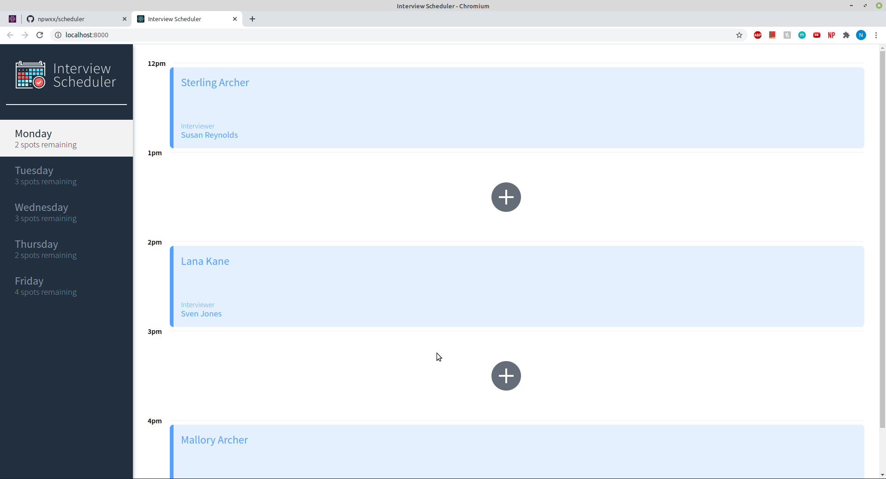
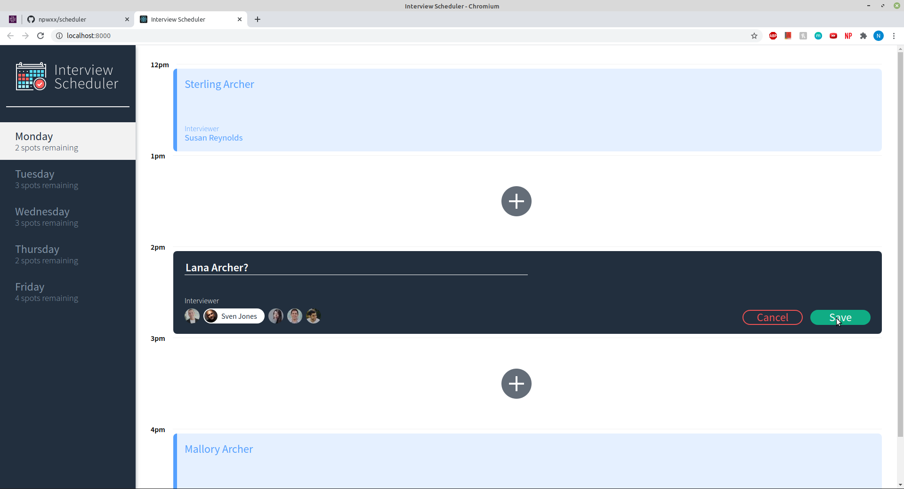
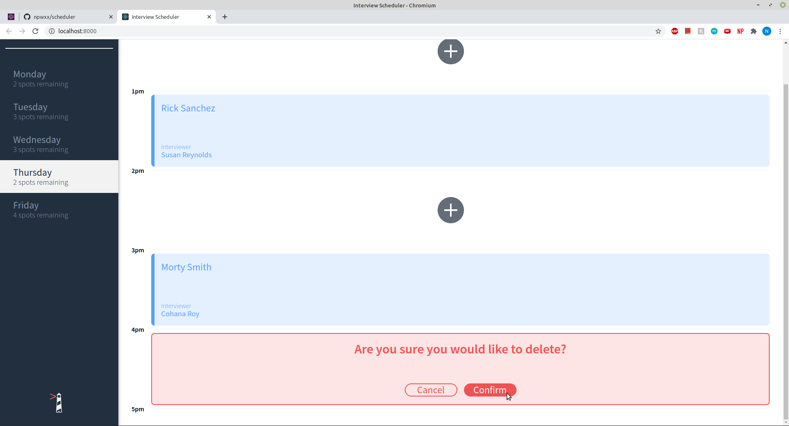

# Interview Scheduler

Forked Project from `@lighthouse-labs`

Author: Nicole Woodcock `@github/npwxx`

## Project Description

A single page application built using React. Data is persisted by the API server using a PostgresSQL database.

This project allows a user to book, edit, or delete an appointment from a list of available times & interviewers.

## Setup

Install dependencies with `npm install`.

## Running Webpack Development Server

```sh
npm start
```

## Running Jest Test Framework

```sh
npm test
```

## Running Storybook Visual Testbed

```sh
npm run storybook
```

## Running Cypress Test Framework

You must run the scheduler API & the Webpack development server before starting Cypress

```sh
npm run cypress
```

## ScreenShots

View of day list & appointments available for Monday

View of create/edit appointment box

View of delete confirmation message

